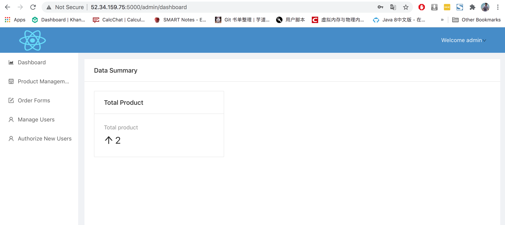
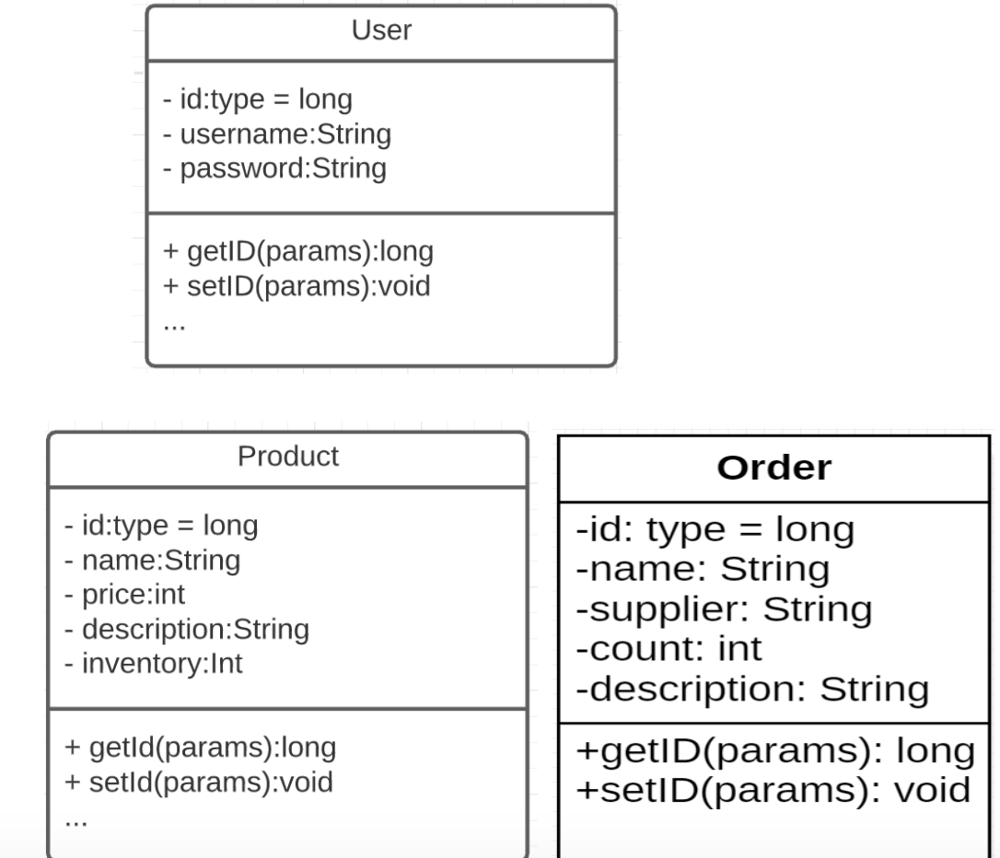
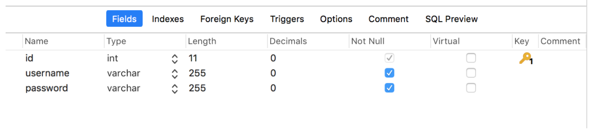
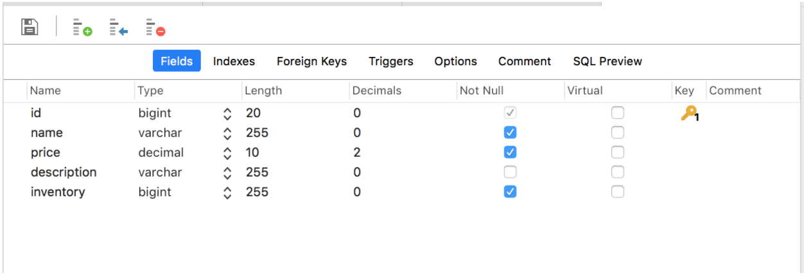
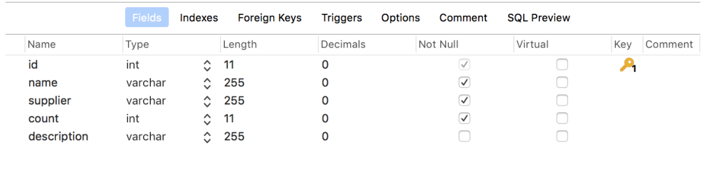

# University Name

San Jose State University

# Course

Enterprise Software - CMPE172 / Fall 2020

# Team Members

* Zefeng Qiu
* Kevin Luu
* Edgar Yu

# Table of content

* [Project Introduction](#Project-Introduction)
* [Sample Demo Screenshots](#Sample-Demo-Screenshots)
* [Folder structure](#Folder-structure)
* [Local Installation Instructions](#Local-Installation-Instructions)
* [Diagrams](#Diagrams)
* [Links](#links)


# Project Introduction

:star: Star us on GitHub — it helps!

Inventory Tracker is a project created to get hands on experience with building enterprise software. The program is geared towards store owners to help with inventory management. Users may keep track of their product inventory, set up supply orders, and give access to employees. Database operations such as creating, reading, updating, and deleting are implemented for all components. The project was built using the SpringBoot framework, React JSX, and AWS RDS. It uses EC2 and Docker for deployment.


# Sample Demo Screenshots 





# Folder structure

```java
.
├── README.md
├── Scripts
│   ├── Dockerfile
│   └── InventoryManager.sql
├── backend
│   ├── mvnw
│   ├── mvnw.cmd
│   ├── pom.xml
│   └── src
├── frontend
│   ├── package-lock.json
│   ├── package.json
│   ├── public
│   └── src
└── images
    ├── authorize\ new\ users.png
    ├── dashboard.png
    ├── login.png
    ├── manage\ users.png
    ├── order\ form.png
    ├── product\ management.png
    └── sequence\ diagram.png
```

# Local Installation Instructions

Prerequisites:

- Java jdk > 14
- install NPM (https://www.npmjs.com/get-npm)
- mysql database > 8.0

 
To start the backend:
- enter database credentials in dev.properties in ./backend/src/main/resources/
    - if dev.properties does not exist, create in this format:
        MY_DB.NAME=
        MY_DB.USER=
        MY_DB.PASSWORD=
        
- run DemoApplication.java

To start the frontend:
- open a new terminal instance
- run the following commnads to get started:
    - cd .\backend\src\main\frontend\
    - npm install (this will take some time to install all the necessary dependencies)
    - npm run start

*The program should be running on http://localhost:5000 if set up correctly
------------------

Build with Maven:
*IF "backend-0.0.1-SNAPSHOT.jar" ALREADY PRESENT, SKIP FIRST TWO STEPS

- In Eclipse, run Maven install on the project.
- In generated target folder, verify "backend-0.0.1-SNAPSHOT.jar" creation
- Enter the directory containing "backend-0.0.1-SNAPSHOT.jar" with terminal
- enter the command: java -jar backend-0.0.1-SNAPSHOT.jar

*The program should be running on http://localhost:5000 if set up correctly

# Diagram

* System Diagram

  

* Class Diagram

  

* Sequence Diagram

  

* DB Schema

  * user

    

  * product

    

  * order

    

## Links

* [Web Application](http://ec2-3-220-67-171.compute-1.amazonaws.com)
* [Video](https://www.youtube.com/watch?v=-8j8O_rk6ZQ&)

